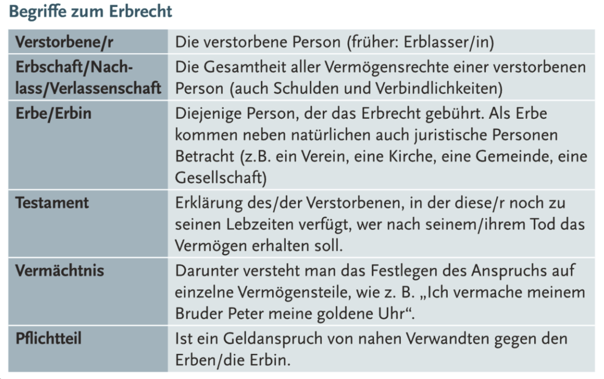
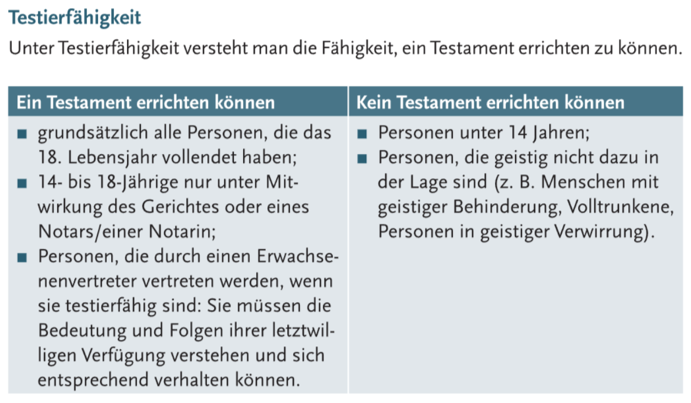
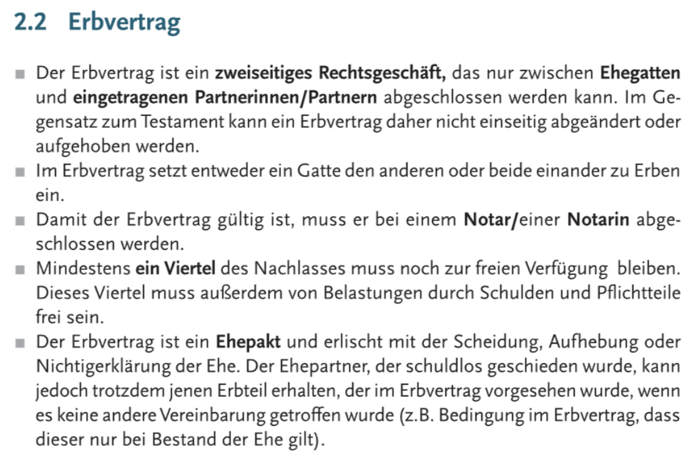
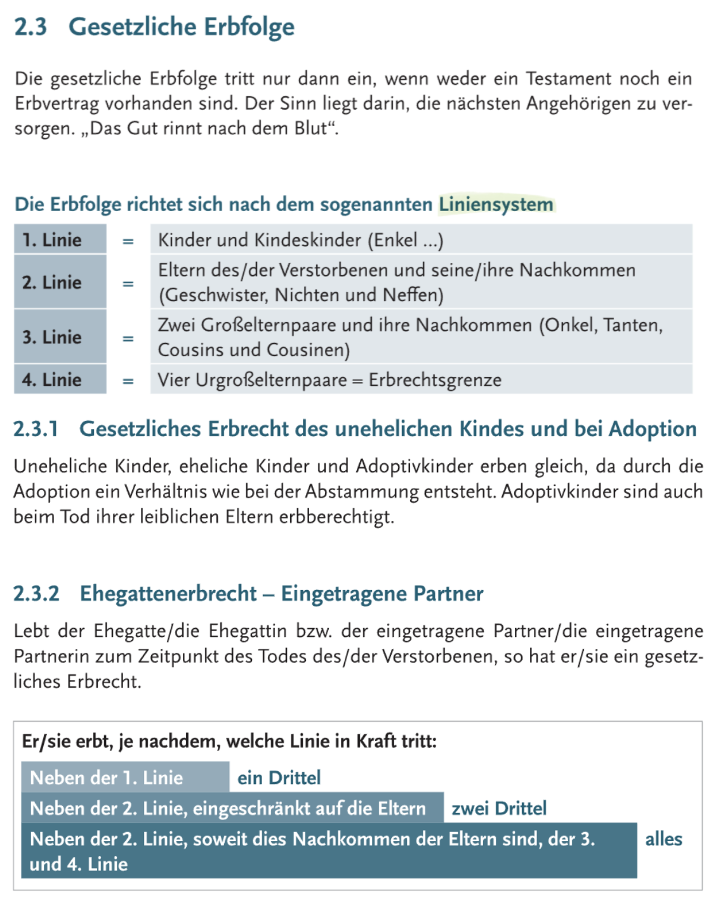
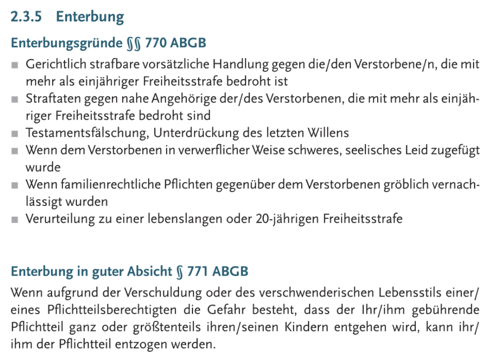
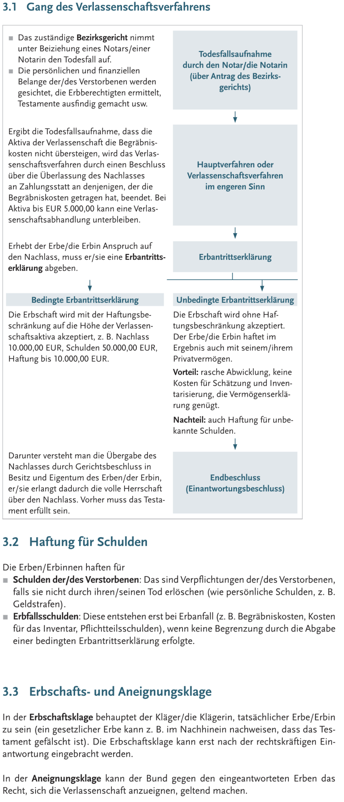

###### 
 WiReTheorie-001 

 
  
  [All in One](https://github.com/IxI-Enki/WiReTheorie-001/blob/master/img/erbrecht.png) 
  

- # 
 Erbrecht 

  
  - ## 
 Erbrecht-Begriffe 

	

  - ## 
 Testamentschließung 

    
  
	- ### 
 Testament-Inhalte 

  
      

	- ### 
 Testierfähigkeit 

      

  - ## 
 > Erbvertrag 

	 

  - ## 
 Erbfolge 

    

  - ## 
 Gesetzlicher Voraus Pflichtteil 

    
	
  - ## 
 Enterbung 

    

- # 
 Formelles Erbrecht 

    
