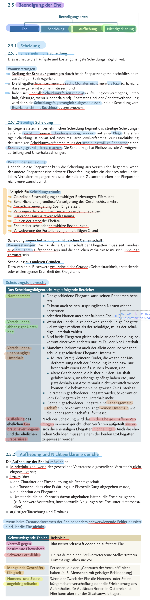

###### 
 WiReTheorie-001 

 
  
  [All in One](https://github.com/IxI-Enki/WiReTheorie-001/blob/master/img/personenrecht.png) 
  

# 
 Familienrecht 

  
# 
 Eherecht 

## 
 Verlobung 

  

## 
 Eheschließung 

  

## 
 Ehewirkungen 

  

## 
 > Ehegüter 

   

## 
 Scheidung 

  

# 
 Lebensgemeinschaft / Ehe 

  
