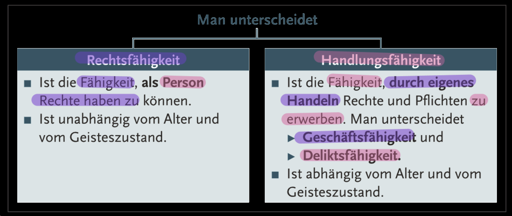
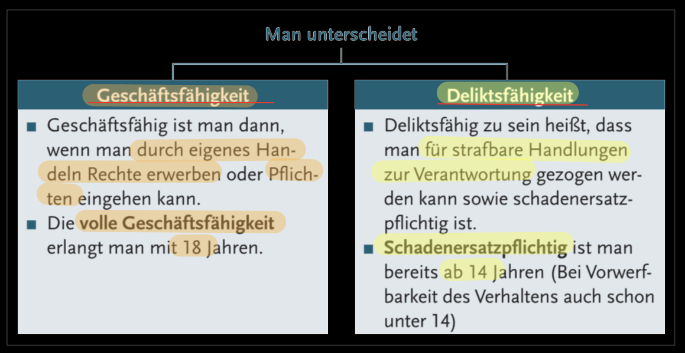
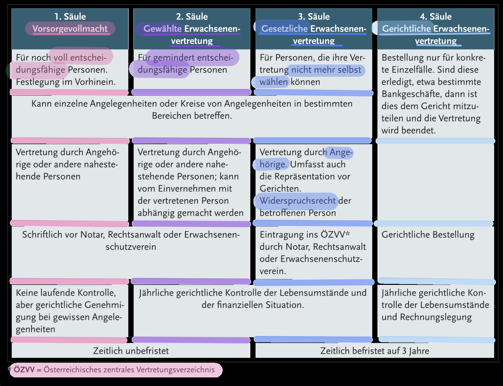

###### 
 WiReTheorie-001 

# 
 Personenrecht 

  
# 
 Natürliche Person 

## 
 Rechtsfähigkeit / Handlungsfähigkeit 

  

### 
 Ende der Rechtsfähigkeit 

  

## 
 Handlungsfähikeit 

  

## 
 Geschäftsfähigkeit 

   

## 
 Erwachsenen Vertretung 

  

### 
 Gesetzliche Vertreter 

  

### 
 Erwachsenen Schutzgesetz 

  
  
# 
 Juristische Person 

  
