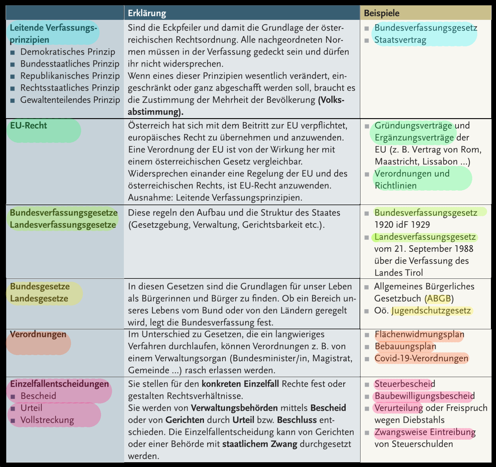

###### 
 WiReTheorie-001 

# 
 Rechtsordnung 

  
## 
 Stufenbau der Rechtsordnung 

  

## 
 Rechtsordnung 

  
  
## 
 Öffentliches Recht / Privatrecht 
 
  

## 
 Arten des Rechts 
 
  

### 
 Rechtssubjekt / Rechtsobjekt
  
  

---

  

  
click für Übung

  

---
